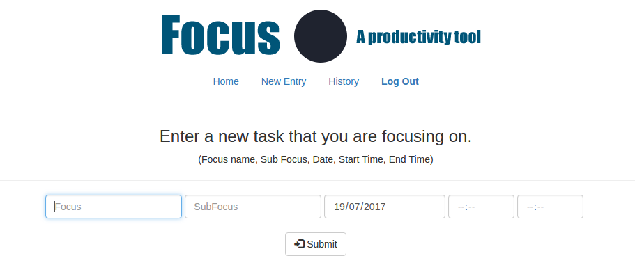
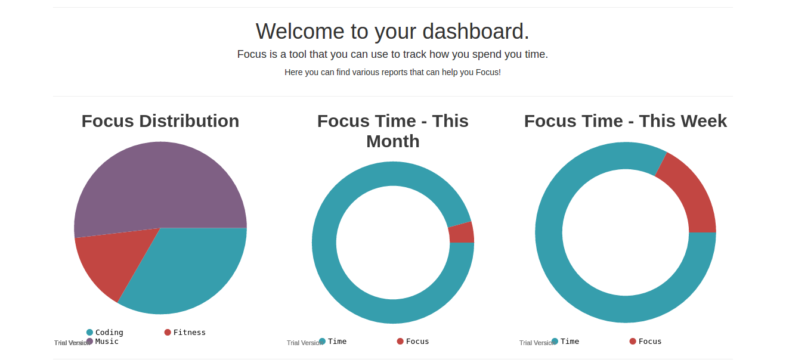
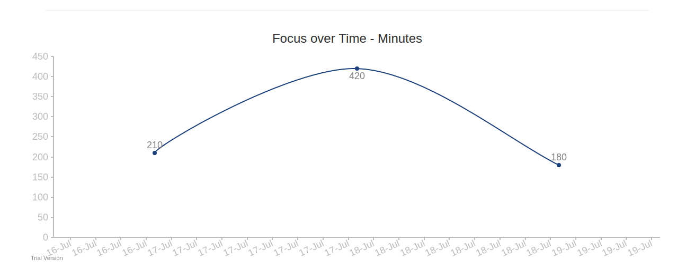

# Focus
Final Project for Harvard's CS50

-------------------------------------------------------------------------------------------------------

Focus is a time management tool that allows users to track their time spent focusing on various activities.

Users can view reports on their focus at their personal dashboard. 

-------------------------------------------------------------------------------------------------------

// ( Currently dependent on CS50's IDE to run - future commits will convert it to a standalone app ) //

-------------------------------------------------------------------------------------------------------

Usage: 

In terminal window

  1. mysql50 start

  2. apache50 start /public

-------------------------------------------------------------------------------------------------------

